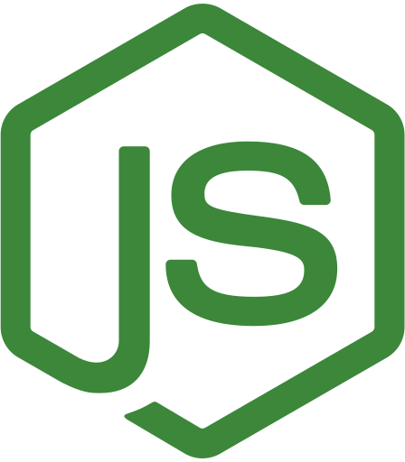
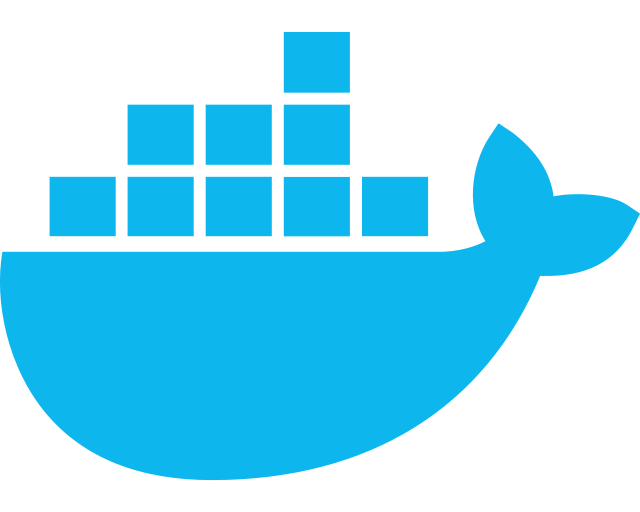

## 💬 About

### Backend developed for GoBarber application :barber:

The main purpose of this backend is to handle, for now things like: 

<ul>
<li>User creation, update and authentication;</li>
<li>Appointments</li>
</ul>

## :hammer_and_wrench: Development Tools Used

  

  
  
Node.js

  

  

  
  
Typescript

  

  

  
  
Docker

  

<b>Node.js</b> environment to manage application settings;

<b>Typescript</b> usage for better comprehension of the code;

<b>Docker</b> environment to simulate a remote database;

## :computer: How to use

<ol>
<li>Clone this repository to your machine;</li>
<li>Install dependencies using `yarn`
</li>
<li>Maybe it will be necessary to setup and configure some docker container. If you have other place to store your data, remember to modify `ormconfig.json` file</li>
<li>To start the devolpment server, execute on a terminal the following:
`yarn dev:server`
</li>
</ol>
